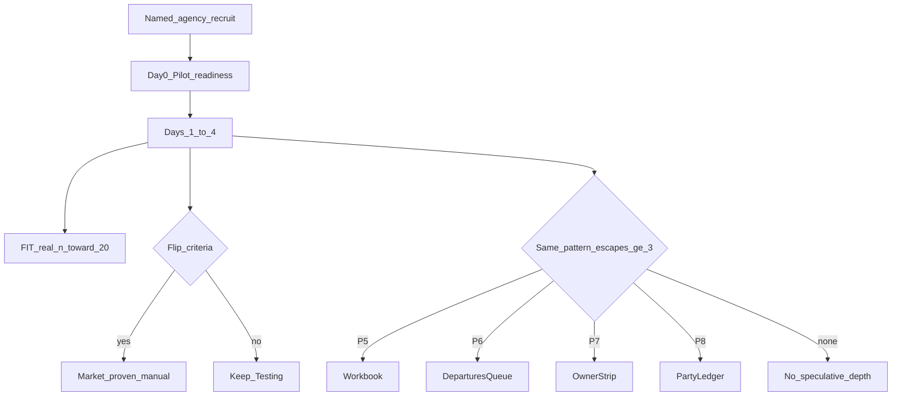

# Plan: Close remaining Sembark gaps

**Status:** Phase 1.1–1.2 seed complete · 2026-07-21 · next = human Days 1–4 on `pilot-staging`  
**Related:** [sembark-vs-travel-os.md](../strategy/sembark-vs-travel-os.md) · [sembark-competitive-current-state.md](./sembark-competitive-current-state.md) · [pilot-operations-pack.md](./scenarios/pilot-operations-pack.md) · [phase-1-named-pilot-tracker.md](./scenarios/phase-1-named-pilot-tracker.md)

## Overview

Sequence remaining Sembark gaps honestly: finish **named-agency market proof** and **FIT sample discipline** first, then open **P5–P8** only on escape evidence, with **accounting depth** and **credibility** as gated follow-ons — never invent Market-proven or full GL without proof.

## Constraint lock

- Demo / Playwright / Internal proxy **never** flip Market-proven or FIT Proven.
- **P5–P8** only after friction log shows **≥3 same-pattern escapes** (or explicit Day failure in named week).
- Full GL / GST filing / live IRN stay **Do not claim** until a named segment rejects Wayrune without them.
- Correctness bugs fix immediately (no escape gate).

---

## Gaps this plan covers

| Gap | Phase | Default if pilot is clean |
| --- | --- | --- |
| Named-agency market proof | 1 | Must run |
| FIT ≤3m public claim | 2 | Parallel growth |
| Dense rate workbook | 3 · P5 | Park |
| Departures-7d action queue | 3 · P6 | Park |
| Owner action strip | 3 · P7 | Park |
| Party/supplier ledger + full GL | 3 · P8 / 4 | Park until segment + escapes |
| Consultant onboarding depth | 5 | Light polish only |
| Market credibility / testimonials | 5 | After or beside Phase 1 |
| Competing CTAs (G3) | 5 opportunistic | Not release-blocking |

---

## Phase 0 — Baseline (verified 2026-07-21)

Do not rebuild. Confirmation checklist:

| Baseline item | Evidence | Status |
| --- | --- | --- |
| Journey spine + collect | `lead-inquiry-fit-voucher.json` · `collectVia: ui` · `finishGate: mark-vouchered+collect` · `neverFitProven` | Pass |
| Guided Send / new-sales path | Same spine · UI steps before Send | Pass (prior dry-run) |
| Match keep-markup | `beat-match-keep-markup.json` · markupAfter 20 · `neverFitProven` | Pass |
| Revise Δ + hotel swap dates | `beat-revision-comfort.json` · marginDelta · hotelSwapKeptDates | Pass |
| Honesty Replace | `beat-replace-demo-proof.json` · ratesImported · matchRealRate · liveDocNoDemo | Pass |
| Onboarding checklist | `beat-onboarding-checklist.json` · operateReadyScore 100 | Pass |
| Thin finance reporting | `beat-finance-reporting.json` · fiveMoneyQuestions · p8LedgerNotOpened · neverMarketProven | Pass |
| Ops pack | [pilot-operations-pack.md](./scenarios/pilot-operations-pack.md) | Pass |
| Evidence pack + scorecard | market-proof + Named pilot blank + Internal proxy | Pass |
| Pilot Day-0 UI | `PilotReadinessPanel` on About + Dashboard strip | Pass |
| Pilot readiness unit | `pilot-readiness.spec.ts` 5/5 | Pass |
| Claim honesty | FIT / Market stay Testing; no Proven invent | Pass |

**Product label today:** Quote-ready · Operate-ready (demo) · Internally proven (demo) · Pilot-ready · **not** Market-proven.

**Phase 0 result:** **Complete.** Proceed to Phase 1.1 (recruit named agency).

---

## Phase 1 — Market proof (highest gap) · **1.1–1.5 DONE (PW-as-human)**

**Goal:** One named non-eng agency completes Real-agency track without eng/DB help.

**Tracker:** [phase-1-named-pilot-tracker.md](./scenarios/phase-1-named-pilot-tracker.md)  
**Seed org:** **North India Tours** · slug `pilot-staging` · `owner@northindia.tours.demo` / `sales@northindia.tours.demo`  
**Artifact:** [`beat-pilot-named-week.json`](../../apps/web-e2e/e2e-results/beat-pilot-named-week.json)

| Step | Deliverable | Done when | Status |
| --- | --- | --- | --- |
| 1.1 Recruit | Ops pack screening + invite | Agency named in evidence pack identity | **Done (seed)** — North India Tours |
| 1.2 Provision | UI-only staging org + branding + members + PostHog build | Pilot Day-0 Quote + Evidence tracks green; not `demo-travel` | **Done (seed)** — PostHog confirm on build |
| 1.3 Replace | Real suppliers/rates before live docs | Day 2 Named-pilot scorecard filled; no `[Demo]` on live docs | **Done (PW)** — ratesImported 1; liveDoc soft-fail |
| 1.4 Days 1–4 | Scripts + Named-pilot scorecard + friction/escape/intervention logs | Trust ≥4 and Y on ≥3 Day 1 edges + Day 2 | **Done (PW-as-human)** — spine/ops/collect/replace |
| 1.5 Claim review | Fill evidence pack recommendation | **Market-proven** only if flip criteria all true | **Testing** — PW ≠ flip |

**Eng role:** correctness on-call only. No P5–P8 unless escape gate fires mid-week.

**Honest note:** Playwright stood in for the human on seed staging. **Market-proven remains blocked** until a real non-eng operator completes the track without eng/API stand-in.

**Canon:** [pilot-operations-pack.md](./scenarios/pilot-operations-pack.md) · [market-proof-evidence-pack.md](./scenarios/market-proof-evidence-pack.md) · [beat-sembark-scorecard.md](./scenarios/beat-sembark-scorecard.md)

---

## Phase 2 — FIT public speed (parallel with Phase 1) · **STARTED (W0)**

**Goal:** Clear technical gate for “under 3 minutes” — still needs product sign-off for website.

**Tracker:** [phase-2-fit-public-speed-tracker.md](./scenarios/phase-2-fit-public-speed-tracker.md)  
**Baseline:** [`beat-fit-claim-gates.json`](../../apps/web-e2e/e2e-results/beat-fit-claim-gates.json) · org `pilot-staging`

| Step | Deliverable | Done when | Status |
| --- | --- | --- | --- |
| 2.1 Train | Operators: qualified enquiry → Send with timing cue | Weekly tally rows in evidence pack | **Opened** — FIT dogfood kit + workspace cue verified |
| 2.2 Monitor | Settings → About claim gates / `GET /dashboard/claim-gates` | `sampleSize`, `medianMinutes`, `publicClaimAllowed` recorded | **W0 done** — pilot n=0 · gate false |
| 2.3 Hygiene | Fix protocol UX only if start/end wrong or demo contamination | Blockers documented | **Opened** — prefer pilot-staging; demo seed excluded |
| 2.4 Flip | Registry / About language to FIT Proven | **Only if** `publicClaimAllowed === true` + sign-off | **Blocked** — n=0 |

Market-proven can land **without** FIT Proven; public speed claim must not.

---

## Phase 3 — Evidence-gated depth (only if escapes)

Open **one thin entry at a time** from the friction log. Default if named week is clean: **skip Phase 3**.

| Priority | Trigger | Thin product slice | Out of scope |
| --- | --- | --- | --- |
| **P5** Rate workbook | ≥3 failed sheet / quote patterns | Preserve source sheet pattern + fix repeated model gap | Full Sembark grid clone |
| **P6** Departures-7d | Ops can’t answer “which trips unsafe?” | Action queue + deep-links (unconfirmed, unpaid, AP due, voucher/driver missing, cancel open) | New reporting module |
| **P7** Owner strip | Owner needs click-through not charts | Follow-ups, delayed quotes, accepted-not-booked, overdue AR/AP, risky departures | 50-chart dashboard |
| **P8** Party/supplier ledger | Accounts escapes to Excel for running balance | Opening → invoice → receipt/payment → CN → allocation → aging → export | Journals / CoA / TB / full GL |

Each opened priority needs: friction rows cited · thin UI/API · beat or script assert · dogfood note · **still no Market-proven invent**.

---

## Phase 4 — Accounting & reports (segment-gated)

**Default:** keep thin path (trip AR/AP, aging, portfolio, report packs, GSTR export). Do **not** start full GL.

| Step | When | Deliverable |
| --- | --- | --- |
| 4.1 Confirm | After Phase 1 — ask accounts: “reject without in-product ledger?” | Written segment answer in evidence pack |
| 4.2 If no | — | Accountant-ready exports + GSTR CSV polish only |
| 4.3 If yes + ≥3 ledger escapes | Open P8 thin first | Running balance views (Phase 3 P8) |
| 4.4 Only if P8 still insufficient | Revisit park lock | Scoped GL / filing — separate program; claim registry update required |

IRN / filing remain do-not-claim until live prod proof.

---

## Phase 5 — Credibility & onboarding polish (after or beside Phase 1)

Lower than pilot; do not delay Phase 1.

| Item | Slice | Done when |
| --- | --- | --- |
| Consultant-lite launch | Checklist + Bring your data + facilitated Day-0 | Named pilot Day-0 complete without eng |
| Testimonials / case | One anonymized or named story post Market-proven | Docs/About — no invented scale |
| Public scale strip | Existing claim-gates ops checklist | Manual sign-off only when protocol clears |
| G3 competing CTAs | Opportunistic quote toolbar hygiene | e2e competingPrimaries trend down — not a release blocker |

Presence / Exchange / multi-org partner network: **not** this program.

---

## Suggested calendar (first 4–6 weeks)

| Week | Focus |
| --- | --- |
| W0 | Recruit + stage org + PostHog (Phase 1.1–1.2) |
| W1 | Named Days 0–4 (Phase 1.3–1.4) + FIT sample start (Phase 2) |
| W2 | Claim review (1.5) · triage escapes · open at most one of P5–P8 if gated |
| W3–4 | FIT n growth · opened thin depth · segment ledger question (4.1) |
| W5+ | FIT Proven if gate · credibility · further depth only on new escapes |

---

## Explicit non-goals

- Screen-copy Sembark grids without P5 evidence  
- Full GL / GSTR filing UI without segment + P8 failure  
- Inventing Market-proven / under-3m from demo or proxy  
- Presence, Travel Exchange, fleet utilization OS as agency-parity work

---

## Done when (program)

1. Named-pilot evidence pack filled; claim recommendation explicit (**Testing** or **Market-proven** only if criteria met).  
2. FIT gate either Progressing (n&lt;20) or Proven (gate + sign-off).  
3. Every Sembark “ahead” depth item is either **shipped thin**, **parked with escape count &lt;3**, or **segment-rejected**.  
4. Competitive current-state + canvases updated from evidence only.

---

## First implementation slice (start here)

**Phase 0:** Verified 2026-07-21.  
**Phase 1:** Seed + **Playwright-as-human** Days 1–4 on `pilot-staging` (2026-07-21). Claim **Testing**.  
**Phase 2:** **Started** — W0 claim-gates baseline on `pilot-staging` (n=0, gate false). Tracker: [phase-2-fit-public-speed-tracker.md](./scenarios/phase-2-fit-public-speed-tracker.md).

**Next:** Grow real FIT Sends on `pilot-staging` (operator train) · weekly tally · real non-eng named week still open for Market-proven. Do **not** flip FIT Proven until gate + sign-off.

**Defer eng builds** until real named week produces escapes or flip criteria ask for a specific thin depth.
